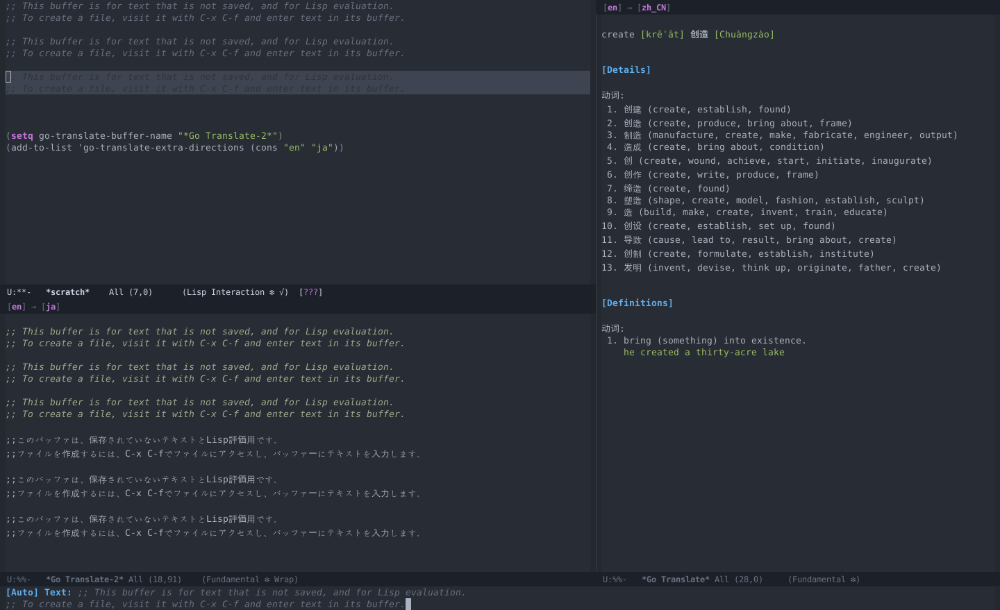

# 谷歌翻译

最近几天使用翻译比较频繁，试了 MELPA 里的几款翻译插件，都不够满意。

[有道笔记](https://github.com/xuchunyang/youdao-dictionary.el):
- 综合表现比较不错，尤其在翻译单词上表现比较优异
- 在翻译大段文字上面，表现不够好
- 更适合在中英文间进行翻译，多语言间的切换不够方便

[Google Translate](https://github.com/atykhonov/google-translate):
- 充分利用了 Google 翻译的强大实力，功能丰富
- 非常慢。因为使用的是同步请求，在进行查询的时候会阻塞 Emacs，用户体验不够好，尤其网络差的时候更是难以忍受
- 翻译的结果显示非常简单粗暴，界面不够友好，操作也不够人性化
- 配置逻辑复杂，想扩展功能，却发现源代码冗余严重（这是一个历史悠久的项目，太长时间疏于维护）

Google 翻译的实力有目共睹，但是 Google Translate 插件的表现却不够好。
因此，干脆就趁周末时间自己动手，丰衣足食，写了这个:

<p align="center">
  
</p>

这个插件借鉴了 [Google Translate](https://github.com/atykhonov/google-translate) 项目的某些想法和代码，其主要的特点有:
- 完全使用异步 (asynchronous) 的方式进行请求，不会产生任何阻塞问题，使用非常流畅
- 优化了翻译结果的显示，界面更加美观自然
- 可以方便进行各种交互操作，尤其可以灵活进行多语言翻译，方便快速进行翻译语言的切换
- 代码简洁，方便拓展。可以非常简单构造新的功能
- 配置简单、使用简单

## 安装

使用 MELPA 进行安装:
```
M-x package-install go-translate RET

(require 'go-translate)
```

或者下载 go-translate.el 并放到某个路径 (/path)，然后在 Emacs 的配置中添加:
```elisp
(add-to-list 'load-path "/path")
(require 'go-translate)
```

## 配置

国内用户首先更改地址，从而获得更好的使用体验:
```elisp
(setq go-translate-base-url "http://translate.google.cn")
```

然后设置翻译语言。如果仅在中英文之间进行翻译，那么只需配置:
```elisp
(setq go-translate-native-language "zh_CN")
```

如果使用的是其他语言，比如中文和法文，那么配置如下:
```elisp
(setq go-translate-native-language "zh_CN")
(setq go-translate-target-language "fr")  ; 你想要翻译成的语言，fr 代表法文
```

[**可选**] 除了上述配置的两种语言，如果平日还可能在其他语言之间进行翻译，那么将它们添加到 `go-translate-extra-directions` 中:
```elisp
(add-to-list go-translate-extra-directions (cons "zh_CN" "ru"))  ; 从中文到俄文之间的翻译
(add-to-list go-translate-extra-directions (cons "en" "fr"))     ; 从英文到法文之间的翻译

;; 或简单设置为:
(setq go-translate-extra-directions '(("zh_CN" . "ru") ("en" . "fr")))
```

其他的配置参数都是可选的，可在 `custom-group` - `go-translate` 中查看。比如:
```elisp
(setq go-translate-buffer-follow-p t)       ; 翻译完成后，总是将光标切换到翻译结果窗口
(setq go-translate-buffer-window-config ..) ; 更改翻译窗口的位置和样式
```

## 使用

核心命令是 `go-translate`，另外有若干简单的扩展命令，比如 `go-translate-popup` 和 `go-translate-kill-ring-save`。

你可以选择将它们绑定到快捷键。比如:
```elisp
(global-set-key "\C-ct" 'go-translate)
(global-set-key "\C-cT" 'go-translate-popup)
```

`go-translate` 默认会使用 buffer 来显示详细的翻译结果。在结果 buffer 中，有若干快捷键:
- `g` 刷新 `q` 退出
- `x` 交换 `源语言` 和 `目标语言` 后重新查询
- `M-n` 和 `M-p`，切换到下一组可用的 [源语言 - 目标语言] 并重新查询

当执行 `go-translate` 命令时，会读取当前选中的文本，如果没有文本被选中，则会读取光标所在的单词，
在接下来打开的 `minibuffer` 界面可以对读取的文本进行修改，然后按下 `回车` 或 `Ctrl-回车` 进行翻译。
`Ctrl-回车` 跟 `回车` 的区别是，`Ctrl-回车` 会在翻译结束后将光标切换到翻译的结果窗口。

另外，可以通过 `C-l` 清空输入，通过 `C-n` 和 `C-p` 切换 [源语言 - 目标语言]。这些 [源语言 - 目标语言] 就是上面配置到 `go-translate-extra-directions` 里的那些。
很多时候，你没有必要手动切换 [源语言 - 目标语言]，`go-translate` 会尝试根据你的输入内容判断并选择合适的翻译语言。

> 一气呵成: `C-c t` 接 `C-return`，然后 `C-x C-x` 选中，`M-w` 复制，`q` 关闭窗口, `C-y` 粘贴

其他的命令:
- `go-translate-popup` 是在光标处通过弹出 `posframe` 的方式对内容进行简短翻译。其实现简单，但比较实用。
- `go-translate-popup-current` 基于上面的命令，它不会打开 `minibuffer`，而是直接翻译光标下的选中文本或单词。
- `go-translate-kill-ring-save` 不会弹出任何界面，而是直接将翻译结果保存到 `kill-ring` 中，你随后可以通过 `C-y` 将其插入到任何地方，或者切换到聊天软件 `C-v` 编辑、发送。这对一些进行翻译工作的人也许比较有用。

当然，基于 `go-translate` 对功能进行扩展很简单，你可以轻松按照自己的意图创造适合自己的翻译命令。

## 扩展

如果想扩展命令的话，只需要覆盖或通过 `let-binding` 方式重新定义如下某些变量即可:
- `go-translate-init-text-function` 默认的翻译内容。如果不指定，会读取选中或光标处的文本
- `go-translate-input-function` 用来处理用户输入和选定翻译语言
- `go-translate-url-function` 用来生成进行请求的 URL
- `go-translate-prepare-function` 在请求发起之前，做的一些预备性工作。比如先创建一个 buffer 并显示部分内容
- `go-translate-request-function` 异步请求到服务器，获取翻译内容
- `go-translate-render-function` 渲染返回的结果

可以查看 `go-translate-popup` 等命令的源代码，了解扩展新功能的方式。

另外，还封装了若干 `go-translate-result-*` 的方法，用于从请求结果中提取相关内容。
这个在自定义 render 函数的时候挺有用的。

## 其他

虽然在结果页面不停按快捷键切换翻译语言挺好玩，或不停刷新也挺爽，但是要注意，如果访问过于频繁，可能会被 Google 以异常流量的错误阻塞你 IP 地址的访问。
这种访问限制过一阵子会被解除，但是也会让你在一段时间之内无法使用其服务。
